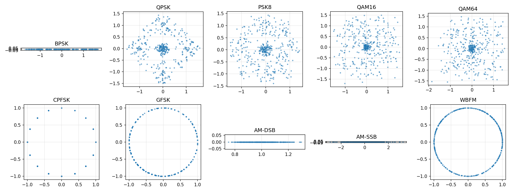
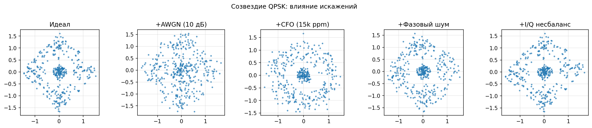
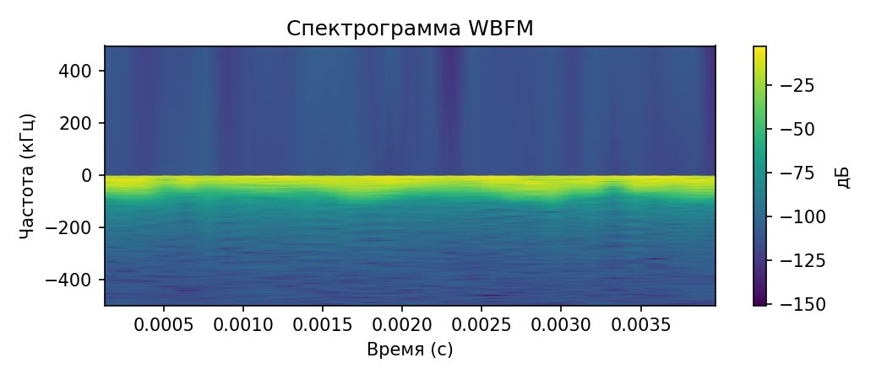

# Классификация радиосигналов по типам модуляции (AMC)

Этот репозиторий содержит полный пайплайн для генерации синтетических радиосигналов, извлечения признаков, обучения и сравнения моделей классификации по типу модуляции: классического ML (на "ручных" признаках) и DL (1D-CNN на IQ-данных, опционально 2D-CNN на спектрограммах).

Поддерживаемые классы модуляций:
- BPSK, QPSK, PSK8
- QAM16, QAM64
- CPFSK, GFSK
- AM-DSB, AM-SSB, WBFM

Основные компоненты:
- Генерация сигналов и модель канала (AWGN, CFO, фазовый шум, тайминг-оффсет, I/Q-несбалансированность, опционально мультипуть).
- Визуализация (время, созвездие, спектр, спектрограмма).
- Извлечение "ручных" признаков (мгновенные, спектральные, кумулянты, I/Q-статистики).
- Классическая модель (градиентный бустинг; fallback на sklearn HGBT).
- Глубокое обучение (1D-CNN на IQ; опционально 2D-CNN на спектрограммах).
- Оценка по SNR-бинам, матрицы ошибок, метрики Accuracy/F1, сравнение ML vs DL.

---

## Полезные материалы

- Теория для новичков: [THEORY_BEGINNER.md](THEORY_BEGINNER.md)
- Основы IQ c математикой и примерами: [IQ_BASICS.md](IQ_BASICS.md)
- Галерея изображений (генерируется `generate_figures.py`):
  - Созвездия: `img/constellations.png`
  - Блок‑схема получения I/Q: `img/iq_block_diagram.png`
  - Влияние искажений на созвездие: `img/constellation_impairments.png`
  - Спектры примеров: `img/spectrum_examples.png`
  - Спектрограмма WBFM: `img/spectrogram_wbfm.png`
  - PSD (Welch) примеры: `img/psd_examples.png`
  - BER‑кривые демо‑модема: `img/ber_curves.png`
  - Снимки созвездий при SNR=12 дБ: `img/constellation_BPSK_12dB.png`, `img/constellation_QPSK_12dB.png`, `img/constellation_QAM16_12dB.png`

---

## Быстрая галерея

[](img/constellations.png)
[](img/constellation_impairments.png)
[](img/ber_curves.png)

[](img/constellation_QPSK_12dB.png)
[](img/constellation_QAM16_12dB.png)
[](img/spectrogram_wbfm.png)

---

## Документация

- Обзор и оглавление: [docs/index.md](docs/index.md)
- Теория для новичков: [docs/theory/THEORY_BEGINNER.md](docs/theory/THEORY_BEGINNER.md)
- Основы IQ (математика, анимации): [docs/theory/IQ_BASICS.md](docs/theory/IQ_BASICS.md)
- Путеводитель по модуляциям: [docs/theory/MODULATIONS_GUIDE.md](docs/theory/MODULATIONS_GUIDE.md)
- Классический ML (признаки и модели): [docs/ML_GUIDE.md](docs/ML_GUIDE.md)
- Глубокое обучение (1D/2D CNN): [docs/DL_GUIDE.md](docs/DL_GUIDE.md)
- Датасеты и генерация: [docs/DATASETS.md](docs/DATASETS.md)
- Оценка и сравнение: [docs/EVALUATION.md](docs/EVALUATION.md)

---

## 1. Быстрый старт

Требования: Python 3.9+ (ARM macOS поддерживается), желательно GPU для ускорения DL, но необязательно.

Установка окружения:
```bash
python3 -m venv .venv
source .venv/bin/activate
pip install -r requirements.txt
```

Генерация датасета (настройки внутри `dataset_builder.py` и `config_and_utils.py`):
```bash
python dataset_builder.py
```
В результате появятся файлы:
- `data/train_v1.npz`
- `data/val_v1.npz`
- `data/test_v1.npz`

Классический ML (обучение и оценка на "ручных" признаках):
```bash
python train_ml.py
```
Скрипт сохранит лучшую модель в `artifacts/ml_best.joblib` и выведет метрики/матрицы ошибок.

Глубокое обучение (1D-CNN на IQ):
```bash
python train_dl.py
```
Скрипт сохранит лучший чекпойнт в `checkpoints_1d/best.keras` и выведет метрики/матрицы ошибок.

Сравнение ML vs DL по SNR:
```bash
python evaluate_compare.py
```
Построит графики Accuracy/F1 vs SNR и матрицы ошибок по выбранным SNR.

Быстрая визуальная проверка сгенерированных сигналов:
```bash
python quick_check.py
```

---

## 2. Структура проекта

- `config_and_utils.py` — конфигурация (`SignalConfig`), утилиты DSP (RRC, gaussian pulse, AWGN, impairments).
- `generators.py` — генераторы модуляций (PSK/QAM/FSK/AM/FM) и единичный пример `generate_example`.
- `channel.py` — мультипуть и полный канал (тайминг→CFO→фаз.шум→I/Q-imbalance→мультипуть→AWGN).
- `dataset_builder.py` — сборка датасета по сетке (класс × SNR), стратифицированные train/val/test, сохранение в NPZ.
- `visualization.py` — функции визуализации (время, созвездие, спектр, спектрограмма).
- `features.py` — "ручные" признаки: мгновенные (амплитуда, фаза, мгнов.частота), спектральные, кумулянты, I/Q-статистика.
- `features_run.py` — загрузка NPZ, конвертация IQ и построение матриц признаков.
- `train_ml.py` — обучение классической модели (LightGBM/XGBoost, fallback: HistGradientBoostingClassifier) и оценка.
- `dl_prep.py` — подготовка `tf.data.Dataset` для 1D/2D вариантов (стандартизация, лёгкие аугментации).
- `models_dl.py` — архитектуры 1D-CNN и 2D-CNN (спектрограмма).
- `train_dl.py` — обучение DL (callbacks: ModelCheckpoint, EarlyStopping, ReduceLROnPlateau) и оценка.
- `evaluate_compare.py` — сравнение ML vs DL по SNR, графики и матрицы ошибок.
- `error_analysis.py` — важности признаков (ML), точность по классам vs SNR (heatmap).
- `requirements.txt` — зависимости.

---

## 3. Теоретический минимум

### 3.1. Форматы сигналов и терминология
- IQ-сигнал (baseband) — комплексная огибающая: I=Re{x}, Q=Im{x}. Используется для цифровой обработки радиосигналов.
- `Fs` — частота дискретизации (Hz); `sps` — samples per symbol (семплов на символ); `SNR` — отношение сигнал/шум (дБ).
- Импульсная фильтрация (например, RRC) — формирование символов для ограничения спектра и снижения ISI.

### 3.2. Типы модуляций
- PSK (BPSK/QPSK/8PSK): информация в фазе, созвездия на окружности; устойчивы к амплитудным искажениям.
- QAM (16/64): информация в амплитуде и фазе; более ёмкие, но чувствительнее к шуму/искажениям.
- FSK (CPFSK/GFSK): информация в частоте; хорошо различимы по мгновенной частоте; GFSK использует гауссов фильтр.
- AM (DSB/SSB): амплитудная модуляция (двухполосная/однополосная); имеет характерные спектральные признаки.
- WBFM: частотная модуляция с большой девиацией (радио/аудио); ярко выраженные частотные паттерны.

### 3.3. Модель канала и искажения (impairments)
- AWGN — аддитивный белый гауссов шум.
- CFO (carrier frequency offset) — частотный сдвиг: x·exp(j·2π·Δf·t).
- Фазовый шум — случайное блуждание фазы (случайный процесс), размывает созвездие.
- Тайминг-оффсет — дробный сдвиг по времени; имитируется sinc-интерполяцией (frac-delay).
- I/Q-imbalance — несоответствие амплитуд/фаз каналов I и Q; деформирует созвездие.
- Мультипуть — свертка с импульсной характеристикой: задержанные копии с затуханием и фазами; вызывает селективное замирание.

### 3.4. "Ручные" признаки (feature engineering)
- Мгновенные (через аналитический сигнал):
  - Амплитуда |x|, фаза ∠x, мгновенная частота f_inst = d/dt unwrap(∠x) · Fs / (2π) и их статистики: среднее/STD/скошенность/эксцесс.
  - Круговые статистики фаз (средний угол, концентрация) учитывают периодичность фазы.
  - Proxy "кластерности" созвездия — доля точек, близких к узлам сетки (для PSK/QAM).
- Спектральные:
  - Энергия по полосам (bandpowers), spectral centroid, rolloff (85%), эффективная ширина полосы.
- Высшие порядки (кумулянты):
  - c20, c40, c42, нормированные на мощность; чувствительны к форме созвездия.
- I/Q-статистика: среднее/STD/скошенность/эксцесс I и Q, корреляция I–Q, соотношение мощностей I/Q.

Эти группы признаков дополняют друг друга: FSK/FM отличимы по мгновенной частоте, QAM/PSK — по кумулянтам и кластерности, AM/FM — по спектру.

### 3.5. Модели
- Классический ML: градиентный бустинг по деревьям (LightGBM/XGBoost, fallback — HistGradientBoostingClassifier). Сильно подходит под табличные признаки, устойчив к разномасштабности.
- DL (1D-CNN): вход `(T,2)` (I,Q), блоки Conv-BN-ReLU со strided downsampling, GlobalAveragePooling, Dropout, Dense-softmax. Хорошо ловит локальные паттерны во времени.
- DL (2D-CNN, опционально): вход — спектрограмма STFT (`(F,T,1)`), небольшой CNN-стэк.

### 3.6. Метрики и оценка
- Accuracy — доля верных предсказаний.
- F1-macro — чувствителен к дисбалансу классов (усреднение по классам).
- F1-micro — взвешивание по поддержке.
- Матрица ошибок — показывает пары классов, где путаница максимальна.
- Оценка по SNR-бинам — важно для радиосистем: качество сильно зависит от SNR.

---

## 4. Типичный рабочий цикл

1) Настроить параметры в `config_and_utils.py` (`SignalConfig`): `fs`, `sps`, `window_size`, сетка `snr_db_grid`, диапазоны impairments.
2) Сгенерировать датасет `python dataset_builder.py` (при необходимости уменьшить `examples_per_class_per_snr` для ускорения).
3) Запустить `python train_ml.py` — получить бейзлайн и важности признаков.
4) Запустить `python train_dl.py` — обучить 1D-CNN (EarlyStopping/ReduceLROnPlateau включены).
5) Сравнить `python evaluate_compare.py` — ML vs DL по SNR, матрицы ошибок.
6) Провести анализ ошибок `error_analysis.py` (важности, heatmap точности по классам vs SNR).

---

## 5. Советы по скорости и качеству

- Для ускорения: уменьшите `examples_per_class_per_snr` и `window_size`, сократите `epochs` в `train_dl.py`.
- Для качества DL: увеличьте данные, добавьте аугментации (умеренные CFO/timing), углубите сеть (ResNet1D/TCN), используйте смешанное представление (IQ+спектрограммы) и энсемблирование.
- Для качества ML: добавьте циклостационарные признаки, автокорреляцию мгновенной частоты, попробуйте CatBoost.
- Для реализма: усложните канал (Rayleigh/Rician с Доплером), используйте более широкий диапазон impairments.

---

## 6. Диагностика и частые вопросы

- Валидация плохая, тест хуже ML: 
  - Увеличьте окно (`window_size`) или число примеров; проверьте баланс классов и SNR.
  - Для DL уменьшите learning rate после плато (работает `ReduceLROnPlateau`).
- Ошибки SciPy/NumPy типов:
  - В `features.py` предусмотрены приведения к `float64` для устойчивости `stats.skew/kurtosis`.
- Нет LightGBM/XGBoost:
  - Скрипт автоматически переключится на `HistGradientBoostingClassifier` из sklearn.
- Медленно строятся спектрограммы:
  - Уменьшите `nperseg`/`noverlap` в `dl_prep.py` или используйте 1D-CNN.

---

## 7. Лицензия и благодарности

Пайплайн создан для учебных и исследовательских целей. Используйте и модифицируйте по своему усмотрению. Будем рады обратной связи и предложениям улучшений.
