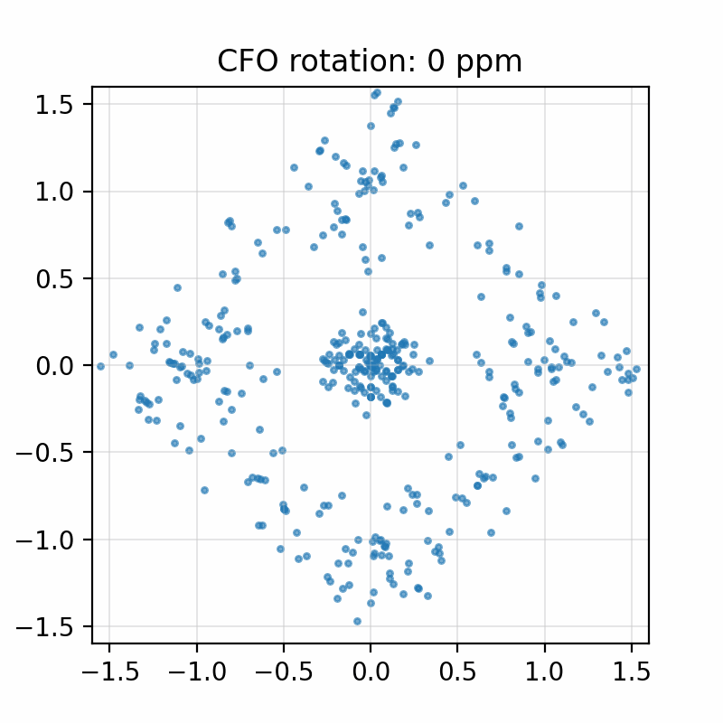
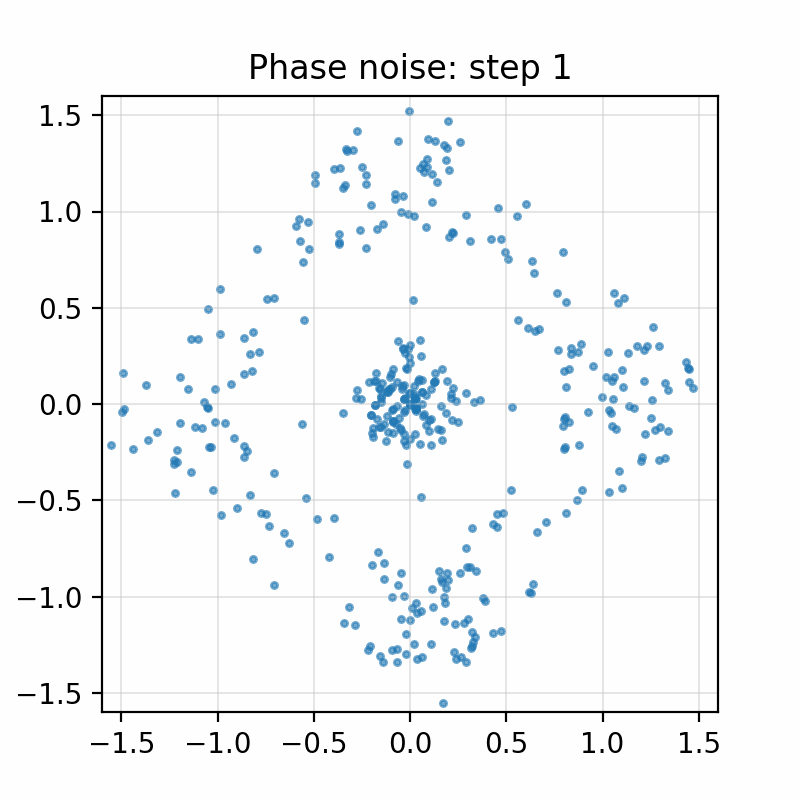
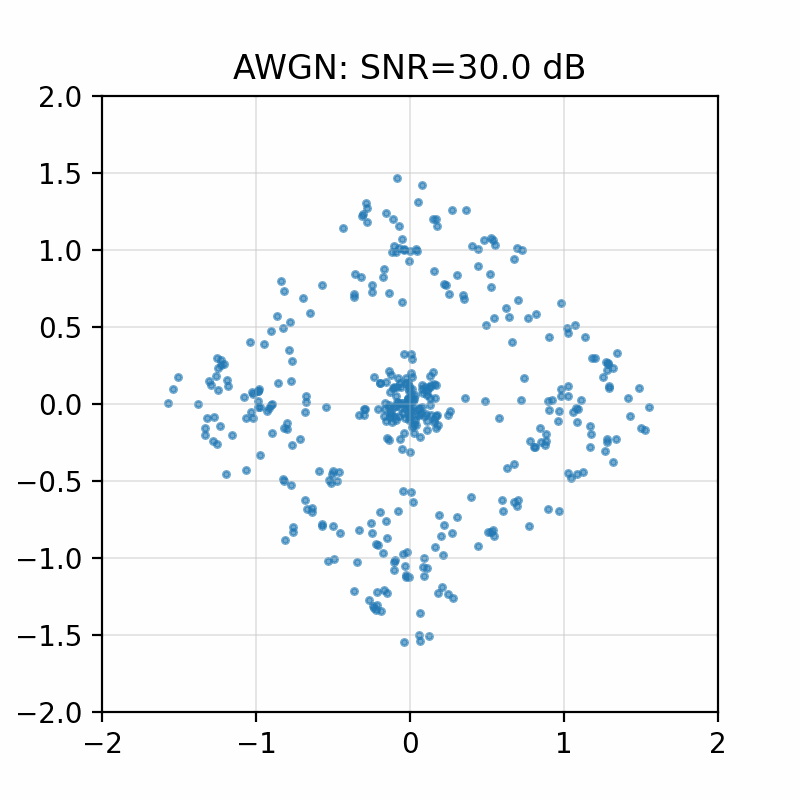
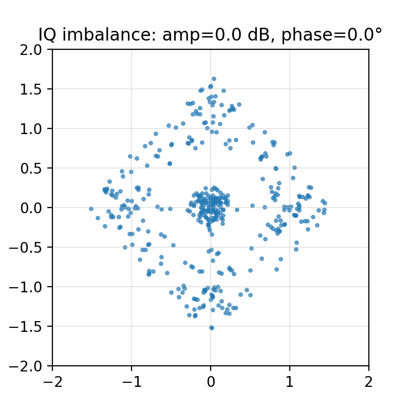

# Основы IQ‑представления (подробно)

Навигация: [Документация](../index.md) › Теория › Этот документ

---

Этот документ — расширение раздела 2 из `THEORY_BEGINNER.md`. Здесь мы тщательно разберёмся, почему нужны две квадратурные ветки (cos и sin), как из них восстанавливаются амплитуда и фаза, и чем удобно комплексное представление для обработки и обучения.

См. иллюстрации:
- Блок‑схема получения I/Q: `../img/iq_block_diagram.png`
- Созвездия: `../img/constellations.png`
- Влияние искажений на созвездие: `../img/constellation_impairments.png`

---

## Оглавление

- [1. От ВЧ‑сигнала к baseband](#1-от-вч-сигнала-к-baseband)
- [2. Почему одной ветки недостаточно](#2-почему-одной-ветки-недостаточно)
- [3. Аналитический сигнал и устранение отрицательных частот](#3-аналитический-сигнал-и-устранение-отрицательных-частот)
- [4. Геометрия в IQ и искажения канала](#4-геометрия-в-iq-и-искажения-канала)
- [5. Мгновенная частота и фазовые производные](#5-мгновенная-частота-и-фазовые-производные)
- [6. Математическая справка: ортогональность и энергия](#6-математическая-справка-ортогональность-и-энергия)
- [7. Практика и отладка](#7-практика-и-отладка)
- [8. Ссылки](#8-ссылки)

### Быстрые ссылки на анимации

- [CFO: поворот созвездия](#анимации)
- [Фазовый шум: размывание точек](#анимации)
- [AWGN: снижение SNR → рост шума](#анимации)
- [I/Q несбаланс: эллиптическая деформация](#анимации)

## 1. От ВЧ‑сигнала к baseband

Исходный реальный радиосигнал на несущей частоте `f_c` можно записать как

```
 s(t) = A(t) cos(2π f_c t + φ(t))
```

где `A(t)` — огибающая (амплитуда), `φ(t)` — фаза, обе медленно меняются во времени по сравнению с `cos(2π f_c t)`.

Чтобы перейти в базовую полосу (около нуля), применяют **квадратурное детектирование**: умножают сигнал на ортогональные опорные `cos(2π f_c t)` и `sin(2π f_c t)`, а затем оставляют только низкочастотные составляющие (LPF удаляет компоненты около `2 f_c`).

```
 I(t) = LPF{ s(t) · cos(2π f_c t) } ≈ 1/2 · A(t) · cos φ(t)
 Q(t) = LPF{ s(t) · sin(2π f_c t) } ≈ 1/2 · A(t) · sin φ(t)
```

Комбинируя их, получаем **комплексную огибающую**

```
 x(t) = I(t) + j Q(t) ≈ 1/2 · A(t) · (cos φ(t) + j sin φ(t)) = 1/2 · A(t) · e^{j φ(t)}
```

Отсюда немедленно:

```
 A(t) = 2 · |x(t)|,   φ(t) = arg x(t) = atan2(Q(t), I(t))
```

То есть пара `(I, Q)` содержит полную информацию об амплитуде и фазе исходного сигнала.

Почему LPF отбрасывает «верхние» частоты? Используем тождества:

```
cos α · cos β = 1/2 [cos(α−β) + cos(α+β)]
cos α · sin β = 1/2 [sin(β+α) + sin(β−α)]
```

При умножении `s(t)` на `cos(2π f_c t)` и `sin(2π f_c t)` появляются слагаемые около нулевой частоты (разность частот) и около `2 f_c` (сумма частот). НЧ‑фильтр подавляет компоненты вокруг `2 f_c`, оставляя «медленную» огибающую, несущую информацию `A(t)` и `φ(t)`[^lpf].

---

## 2. Почему одной ветки недостаточно

Если бы мы оставили только умножение на `cos(2π f_c t)`, после LPF получилось бы `~ A(t) cos φ(t)`. Для фаз `+φ` и `−φ` получим одинаковый результат (чётность косинуса). Мы теряем знак и, значит, однозначность фазы. Вторая, квадратурная ветка `sin(2π f_c t)` даёт недостающую информацию (нечётность синуса), и вместе они образуют ортонормированный базис на периоде несущей.

Интуитивно: мы измеряем «проекции» вектора на оси X и Y, а не только его «тень» на одну ось.

---

## 3. Аналитический сигнал и устранение отрицательных частот

Через преобразование Гильберта можно построить **аналитический сигнал** `z(t) = s(t) + j · H{s(t)}`, который не содержит отрицательных частот. В базовой полосе роль такого сигнала играет `x(t) = I + jQ`. Это удобно, потому что линейные операции в частотной области (фильтрация, сдвиги) становятся умножениями/свёртками над комплексными величинами без двусмысленности с «левыми/правыми» частотами.

Почему это практично: работа в комплексной baseband‑форме эквивалентна «снятию» несущей и хранению только полезной информации — амплитуды и фазы. Это уменьшает полосу обработки, упрощает цифровые фильтры и позволяет легко моделировать импейрменты как `x(t)·e^{jθ(t)}` и свёртки `x*h`[^zb].

---

## 4. Геометрия в IQ и искажения канала

- **CFO**: умножение на `e^{j 2π Δf t}` — это ротатор: поворачивает точки созвездия со скоростью `Δf`. См. иллюстрацию влияния искажений (`img/constellation_impairments.png`).
- **Фазовый шум**: случайное блуждание фазы — размывает точки по окружности.
- **I/Q несбаланс**: различный масштаб и перекос каналов — эллиптическая деформация и наклон созвездия.
- **Мультипуть**: линейная свёртка комплексного сигнала с `h[n]` — растягивает импульсные отклики символов, может «мазать» кластеры.

Все эти эффекты естественно описываются в комплексной форме; это делает и классическую обработку (DSP), и обучение (CNN на `(T,2)`) более прямолинейными.

### Анимации

Ниже — динамические иллюстрации двух типичных эффектов:

- Поворот созвездия из‑за CFO:



Подпись: CFO (рассинхронизация частоты) вызывает равномерный поворот созвездия. В задачах классификации это мешает PSK/QAM — необходимо обучать инвариантности или компенсировать до классификатора. См. раздел про CFO в `THEORY_BEGINNER.md` (§5) и обсуждение фазовых оценок в этом документе (§5).

- Размывание созвездия из‑за фазового шума (случайное блуждание фазы):



Подпись: фазовый шум — случайное блуждание угла; кластеры «смазываются» по окружности, что снижает угловые зазоры в PSK и повышает BER. Для QAM — ухудшает фазовую составляющую при решении по уровням.

- Нарастание шума AWGN (SNR снижается):



Подпись: AWGN приводит к изотропному распуханию облаков; для QAM с близкими уровнями это быстро повышает ошибки соседних решений. Сравните с PSD/спектрами в `THEORY_BEGINNER.md` (§21), где растёт шумовой пол.

- Усиление несбалансированности I/Q (амплитудный и фазовый перекос):



Подпись: несбалансированность I/Q деформирует созвездие в эллипс и может сдвигать центры кластеров. Это приводит к систематическим ошибкам квантизации в QAM и перекосу секторов у PSK. См. матричную модель в `THEORY_BEGINNER.md` (§18).

---

## 5. Мгновенная частота и фазовые производные

Определим фазу `φ[n] = unwrap(arg x[n])`. Тогда **мгновенная частота**

```
 f_inst[n] = (φ[n] − φ[n−1]) · Fs / (2π)
```

Даёт очень информативный признак для FM/FSK: у них распределение `f_inst` резко отличается от PSK/QAM. В проекте такие признаки вычисляются в `features.py` (функция `instantaneous_features`).

---

## 6. Математическая справка: ортогональность и энергия

За один период несущей `T_c = 1 / f_c` функции `cos(2π f_c t)` и `sin(2π f_c t)` ортогональны:

```
 ∫_0^{T_c} cos(2π f_c t) · sin(2π f_c t) dt = 0
 ∫_0^{T_c} cos^2(2π f_c t) dt = ∫_0^{T_c} sin^2(2π f_c t) dt = T_c / 2
```

Это обосновывает, почему умножение и последующая НЧ‑фильтрация извлекают независимые «координаты» огибающей.

### Почему применяют квадратурное детектирование (практические причины)

- Извлекаем сразу амплитуду и фазу (а значит, и мгновенную частоту) — необходимо для PSK/QAM/FM/FSK.
- Устраняем громоздкую высокочастотную несущую, экономим полосу и вычисления в ЦОС.
- Совместимо с архитектурами прямого преобразования (zero‑IF) и **image‑rejection** приёмниками: наличие двух ортогональных путей позволяет подавлять «зеркальный» канал[^image].
- Любые повороты/сдвиги в канале становятся простыми операциями над комплексной огибающей (умножение на `e^{jθ}`, свёртка с `h[n]`).

### Почему оставляют только низкочастотные составляющие (LPF)

- Полезная информация об изменениях `A(t), φ(t)` медленная относительно несущей `f_c`, а суммарные компоненты около `2 f_c` не несут новой информации о данных.
- LPF предотвращает алиасинг при последующей дискретизации/даунсэмплинге и задаёт нужную полосу baseband‑сигнала (обычно до нескольких раз ширины символной полосы).
- В цифровой реализации это облегчает синхронизацию тайминга и последующую демодуляцию/классификацию.

---

## Сноски

[^lpf]: НЧ‑фильтр (LPF) подавляет сумму частот около `2 f_c`, оставляя только разностные компоненты близко к нулю, где лежит огибающая. Это стандартная операция в супергетеродинных и zero‑IF приёмниках.

[^zb]: Zero‑IF (прямое преобразование) переносит спектр непосредственно в ноль, поэтому комплексная огибающая полностью описывает сигнал без необходимости хранить высокочастотную несущую.

[^image]: «Зеркальный» канал — спектральное отражение относительно промежуточной частоты; квадратурная обработка позволяет его подавлять за счёт ортогональности путей I и Q.

---

## 7. Практика и отладка

- Посмотрите блок‑схему: `img/iq_block_diagram.png`.
- Постройте созвездие: `visualization.plot_constellation(x)`.
- Включите искажения (CFO/фазовый шум/IQ‑несбаланс) и посмотрите, как меняется картинка: `img/constellation_impairments.png`.
- Для DL используйте форму `(T,2)` как в `dl_prep.make_dataset_1d` — без «рукодельных» демодуляций; модель сама научится инвариантам.

---

## 8. Ссылки

- Lyons, "Understanding Digital Signal Processing"
- Proakis, "Digital Communications"
- O’Shea & Hoydis, "An Introduction to Deep Learning for the Physical Layer"
