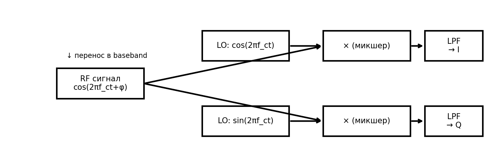

# Теория по классификации радиосигналов для новичков

Навигация: [Документация](../index.md) › Теория › Этот документ

---

Этот документ объясняет базовые понятия цифровой обработки сигналов (DSP) и связи, которые нужны, чтобы понимать, что происходит в проекте по классификации типов модуляций (AMC: Automatic Modulation Classification). Он рассчитан на читателя без глубоких знаний в радиотехнике и машинном обучении.

---

## TL;DR для самых занятых

- Сигнал представляем как `x[n] = I[n] + j·Q[n]` — это даёт амплитуду и фазу сразу.
- Модуляции различаются «где лежит информация»: в фазе (PSK), в амплитуде+фазе (QAM), в частоте (FSK/FM), в огибающей (AM).
- Канал портит сигнал: AWGN (шум), CFO (поворот фазы), фазовый шум (дрожание угла), тайминг‑сдвиг, I/Q‑несбаланс, мультипуть.
- ML хорошо работает на признаках (мгновенная частота, кумулянты, спектральные); DL учится прямо по `(T,2)` или спектрограммам.
- Оценивайте по SNR‑бинам и смотрите матрицы ошибок — так видно, что именно путается.

Быстрый маршрут в проекте:
1) Пробежаться по картинкам в README (созвездия/спектры).
2) Запустить `quick_check.py` и глазами увидеть примеры.
3) Прочитать разделы 2, 4, 5 ниже и «Метрики» (раздел 8).

---

## Оглавление

- [1. Что такое сигнал и зачем его классифицировать](#1-что-такое-сигнал-и-зачем-его-классифицировать)
- [2. Дискретизация, частоты, IQ-представление](#2-дискретизация-частоты-iq-представление)
- [3. Символы, скорость и импульсная фильтрация](#3-символы-скорость-и-импульсная-фильтрация)
- [4. Типы модуляций (кратко и наглядно)](#4-типы-модуляций-кратко-и-наглядно)
- [5. Шум и искажения канала (impairments)](#5-шум-и-искажения-канала-impairments)
- [6. Преобразования и «ручные» признаки](#6-преобразования-и-ручные-признаки)
- [7. Классические модели и глубокое обучение](#7-классические-модели-и-глубокое-обучение)
- [8. Обучение, валидация, тест и метрики](#8-обучение-валидация-тест-и-метрики)
- [9. Практические советы](#9-практические-советы)
- [10. Частые вопросы](#10-частые-вопросы)
- [11. Мини-глоссарий](#11-мини-глоссарий)
- [12. Как всё это связано с кодом](#12-как-всё-это-связано-с-кодом)
- [13. Децибелы и SNR: как считать правильно](#13-децибелы-и-snr-как-считать-правильно)
- [15. Импульсное формирование и согласованный приём](#15-импульсное-формирование-и-согласованный-приём)
- [16. Математика популярных модуляций](#16-математика-популярных-модуляций-упрощённо)
- [17. Канал: мультипуть, Релея, Райс, Доплер](#17-канал-мультипуть-релея-райс-доплер)
- [20. STFT и параметры спектрограммы](#20-stft-и-параметры-спектрограммы)
- [21. PSD и метод Уэлча](#21-psd-и-метод-уэлча)
- [26. Метрики, матрицы ошибок и оценка по SNR](#26-метрики-матрицы-ошибок-и-оценка-по-snr)

## 1. Что такое сигнал и зачем его классифицировать

- **Сигнал** — это функция от времени, несущая информацию. Радиосигнал — электрический сигнал, который можно передавать по воздуху с помощью радиоволн.
- **Модуляция** — способ «упаковки» информации в сигнал: изменяем амплитуду, фазу или частоту так, чтобы получатель мог восстановить исходные данные.
- **Классификация модуляций** нужна, чтобы автоматически определить, какой тип модуляции используется (например, BPSK или QAM16). Это полезно в радиоконтроле, когнитивном радио, пассивном мониторинге спектра и т.д.

---

## 2. Дискретизация, частоты, IQ-представление

- **Дискретизация**: непрерывный сигнал измеряется через одинаковые промежутки времени — получаем последовательность чисел (отсчётов). Частота дискретизации `Fs` — сколько отсчётов в секунду.
- **Теорема Найквиста–Шеннона**: чтобы корректно восстановить сигнал, частота дискретизации должна быть больше, чем в 2 раза превышать максимальную частоту в сигнале (минимум `Fs > 2·Fmax`).
- **Комплексная экспонента**: радиосигнал удобно описывать как `x(t) = A(t) · exp(j·φ(t))`, где `A(t)` — амплитуда, `φ(t)` — фаза. Комплексность — это математическое удобство, фактически в компьютере храним два канала: действительную часть (I) и мнимую (Q).

IQ на практике: упрощённая блок‑схема снятия несущей (гетеродин, микшеры и НЧ‑фильтры), получаемые каналы I и Q:


- **IQ-сигнал (baseband)**: `x[n] = I[n] + j·Q[n]`. Это «снятая» несущая (низкочастотная огибающая), удобная для цифровой обработки. В нашем проекте мы работаем именно с IQ-последовательностями.

Немного формально (почему две ветки — cos и sin — дают полную информацию):

Пусть реальный сигнал на несущей: `s(t) = A(t) cos(2π f_c t + φ(t))`.
Умножим его на `cos(2π f_c t)` и `sin(2π f_c t)`, а затем пропустим через НЧ‑фильтр (LPF), отбрасывая составляющие около `2 f_c`:

$$
\begin{aligned}
I(t) &= \mathrm{LPF}\{\, s(t)\cos(2\pi f_c t)\,\} \;\approx\; \tfrac{1}{2} A(t)\cos\varphi(t),\\
Q(t) &= \mathrm{LPF}\{\, s(t)\sin(2\pi f_c t)\,\} \;\approx\; \tfrac{1}{2} A(t)\sin\varphi(t).
\end{aligned}
$$

### Зачем нужен НЧ‑фильтр (LPF)

- LPF (Low‑Pass Filter) пропускает «медленную» огибающую и подавляет компоненты около `2 f_c`, появляющиеся при умножении на опорные несущие.
- Так мы переходим в базовую полосу (baseband), где удобно измерять амплитуду `A(t)` и фазу `φ(t)`, строить спектры и обучать модели.
- Работа в baseband экономит полосу и вычисления: вместо ВЧ‑носителя остаётся информативная огибающая `I(t), Q(t)`.

Тогда комплексная огибающая $x(t) = I(t) + j Q(t)$ даёт

$$
A(t) = 2\,\sqrt{ I^2(t) + Q^2(t) },\qquad \varphi(t) = \mathrm{atan2}\big(Q(t),\, I(t)\big).
$$

То есть из двух ортогональных проекций мы однозначно восстанавливаем амплитуду и фазу. Если оставить только одну ветку, информация о фазе становится неоднозначной (например, φ и −φ дают одинаковый cos φ).

---

## 3. Символы, скорость и импульсная фильтрация

- **Символ** — «порция» данных, передаваемая за фиксированное время (символьный интервал). В цифровых модуляциях каждый символ кодирует несколько битов.
- **Символьная скорость**: сколько символов передаётся в секунду. Часто выбирают `samples per symbol (sps)` — сколько отсчётов мы берём на один символ (например, `sps=8`). Тогда длина окна в отсчётах `T` содержит `T/sps` символов.
- **Импульсная фильтрация (pulse shaping)**: фильтры вроде **RRC (root-raised cosine)** ограничивают спектр сигнала и уменьшают межсимвольные искажения (ISI). Это делает спектр компактнее и связь — корректнее.

---

## 4. Типы модуляций (кратко и наглядно)

- **PSK (Phase Shift Keying)** — ключение фазы. Символы — точки на окружности:
  - BPSK: 2 точки (фаза 0° и 180°)
  - QPSK: 4 точки (0°, 90°, 180°, 270°)
  - 8PSK: 8 точек
  Чем больше точек, тем выше скорость (больше бит на символ), но тем сложнее распознавать при шуме.

- **QAM (Quadrature Amplitude Modulation)** — меняются и амплитуда и фаза. Точки созвездия в виде квадратной решётки:
  - QAM16: 16 точек
  - QAM64: 64 точки
  QAM позволяет передавать больше информации, но чувствительнее к шуму и искажениям.

- **FSK (Frequency Shift Keying)** — ключение частоты (частота прыгает между значениями):
  - **CPFSK**: непрерывная фаза (continuous phase), мягче по спектру
  - **GFSK**: частота «сглажена» гауссовым фильтром перед фазовой интеграцией

- **AM/FM** — аналоговые модуляции:
  - **AM-DSB**: амплитудная двухсторонняя (две боковые полосы)
  - **AM-SSB**: амплитудная односторонняя (одна боковая полоса)
  - **WBFM**: широкополосная ЧМ (как в FM-радио), у неё характерная «шероховатость» мгновенной частоты

- **Созвездие** — точки IQ на плоскости. У PSK — на окружности; у QAM — решётка; у FM/FSK — созвездие выглядит более «размазанным», потому что информация в частоте, а не в фиксированном наборе точек.

Иллюстрация созвездий (синтетические, без шума/канала):


Подпись: на окружности — PSK (амплитуда почти постоянна, различие по углу); решётка — QAM (различия и по I, и по Q); у частотных/аналоговых (FSK/FM/AM) облака менее «узловые».

До/после основных искажений (на примере QPSK):


Подпись: слева направо — идеал; добавление шума (кластеры «распухают»); CFO — общее вращение; фазовый шум — «размытие» по окружности; I/Q‑несбаланс — эллиптическая деформация и наклон.

Почему созвездия выглядят именно так:
- PSK: информация в фазе → точки на окружности (амплитуда почти постоянна), различие по углу.
- QAM: информация в амплитуде и фазе → решётка уровней по `I` и `Q`.
- FSK/FM: информация в частоте → фаза непрерывно «ползёт», стационарных узлов нет, облака «размазаны».
- AM: изменяется огибающая → точки вытягиваются по радиусу.

Графики амплитуды/времени:
- Используйте `visualization.plot_time_iq(x, fs, n)` (или `python quick_check.py`) чтобы увидеть `I(t), Q(t)`. Для AM огибающая «дышит», для PSK/QAM — почти постоянна между переходами символов, для FM/FSK — сильнее меняется фаза.

### Анимации (динамическая иллюстрация искажений)

- Поворот созвездия из‑за CFO:


Комментарий: наблюдайте, как все точки поворачиваются с постоянной угловой скоростью — это эквивалент глобального частотного сдвига (рассинхронизация гетеродинов). В анимации изменяется параметр частотного сдвига `Δf` (CFO): чем больше `|Δf|`, тем быстрее вращение.

- Размывание созвездия из‑за фазового шума:


Комментарий: точки «дрожат» по углу — фазовый шум размывает кластеры по окружности, особенно критично для высоких порядков PSK. В анимации растёт дисперсия шага фазового блуждания (параметр `phase_noise_std`): выше значение → сильнее «размытие».

- Нарастание шума AWGN (снижение SNR):


Комментарий: при снижении SNR облака расширяются равномерно во все стороны — растёт вероятность пересечения границ решений.

- Усиление несбалансированности I/Q (амплитудный и фазовый перекос):


Комментарий: несбаланс I/Q тянет созвездие в эллипс и искажает углы — это может смещать квантизацию у QAM и «косить» PSK‑сектора.

Подробные пояснения к анимациям см. в `IQ_BASICS.md` (раздел «Геометрия в IQ и искажения канала»).

---

## Чем чаще всего путают классы и почему

- QAM16 ↔ QAM64 при низком SNR: расстояния между точками малы; помогает кумулянты (`c40`, `c42`) и «кластерность» созвездия.
- PSK8 ↔ QAM16 при сильном шуме/несбалансе: решётка в QAM превращается в «мутный круг». Полезны признаки амплитуды (у PSK амплитуда стабильнее).
- AM‑DSB ↔ AM‑SSB в спектре: обе имеют боковые полосы; у SSB одна из них подавлена — смотрите `spectrum_examples.png` и PSD.
- GFSK ↔ WBFM: обе угловые; спектрограмма у WBFM шире и «шероховатее» во времени, мгновенная частота у FM намного более вариативна.

Подсказка: держите под рукой `img/constellations.png`, `img/spectrum_examples.png`, `img/spectrogram_wbfm.png`.

---

## 5. Шум и искажения канала (impairments)

- **AWGN** — аддитивный белый гауссов шум. Характеризуется **SNR (Signal-to-Noise Ratio)** — чем выше SNR (в дБ), тем чище сигнал.
- **CFO (Carrier Frequency Offset)** — частотный сдвиг (например, из-за рассинхронизации генераторов). Проявляется как вращение фазы со временем.
- **Фазовый шум** — случайное блуждание фазы (как «тряска»), размывает созвездие.
- **Тайминг-оффсет** — дробный сдвиг по времени (символы «съезжают»), ухудшает выборку символов.
- **IQ-несбалансированность** — каналы I и Q слегка различаются по амплитуде и фазе; созвездие «косится».
- **Мультипуть** — сигнал доходит несколькими путями с задержками и фазами (отражения). Это свёртка с импульсной характеристикой канала, приводит к селективному замиранию и интерференции.

Все эти эффекты делают данные реалистичными и проверяют устойчивость классификатора.

---

## 6. Преобразования и «ручные» признаки

Чтобы алгоритму было легче различать модуляции, рассчитывают признаки — числовые характеристики сигнала:

- **Мгновенные признаки** (через аналитический сигнал `x = I + jQ`):
  - Амплитуда `|x|`, фаза `∠x`, **мгновенная частота** `f_inst` — конечная разность развернутой фазы: `f_inst[n] = (\mathrm{unwrap}(\varphi[n]) - \mathrm{unwrap}(\varphi[n-1]))\,Fs/(2\pi)`.
  - Для каждого — статистики: среднее, стандартное отклонение, скошенность (асимметрия), эксцесс (расплющенность распределения).
  - **Круговые статистики** фаз (средний угол и «концентрация») — учитывают, что фаза периодична по 2π.

- **Спектральные признаки**:
  - **Полосы энергии (bandpowers)** — сколько энергии в разных частотных диапазонах.
  - **Spectral centroid** — «центр тяжести» спектра.
  - **Rolloff** — частота, ниже которой находится, например, 85% энергии.
  - **Эффективная ширина полосы** — на основе дисперсии частот.

- **Кумулянты (высшие порядки)**: краткие комбинации моментов комплексной случайной величины (см. §22), инвариантные к масштабу. Нормированные `c20`, `c40`, `c42` чувствительны к форме созвездия и помогают отличать QAM/PSK.

- **I/Q-статистика**: среднее/STD/скошенность/эксцесс I и Q, корреляция I–Q, соотношение мощностей I/Q.

Зачем это работает:
- **FSK/FM** хорошо различаются по распределению мгновенной частоты.
- **QAM/PSK** — по кумулянтам и «кластерности» созвездия.
- **AM/FM** — по спектральным характеристикам.

---

## Частые ошибки и как их избежать

> Важно: большинство «странностей» объясняются несогласованными параметрами и неправильной нормализацией.

- Несогласованы `Fs` и параметры STFT — ось частот «врет». Убедитесь, что `fs` правильно передаётся и подписи в kHz/Hz корректны.
- Не снят CFO — созвездие «крутится», признаки фазы ломаются. Либо компенсируйте CFO, либо обучайте инвариантность (аугментации).
- Неверная нормализация IQ — амплитудные признаки искажаются. Используйте стандартизацию по примеру (см. `dl_prep.standardize_iq`).
- Оценка без стратификации по SNR — метрики «красивые», но нерабочие в шуме. Обязательно агрегируйте по SNR‑бинам.

---

## 7. Классические модели и глубокое обучение

- Схемы (общее представление):

```
Сигнал (IQ) → Признаки (F) → ML-классификатор → Класс
```

```
Сигнал (IQ) → [Стандартизация] → CNN (1D/2D) → Softmax → Класс
```

- **Классический ML** (градиентный бустинг на деревьях: LightGBM/XGBoost/HistGradientBoostingClassifier):
  - Отлично работает с разнородными табличными признаками
  - Довольно устойчив к масштабам, хорошо интерпретируем через важности признаков
  - Быстро обучается

- **Глубокое обучение** (CNN):
  - **1D-CNN**: вход — последовательность `(T, 2)` (I и Q). Свёртки ловят локальные временные паттерны, переходы между символами, структуру импульсной фильтрации.
  - **2D-CNN**: вход — спектрограмма `(F, T, 1)` как «картинка». Особенно полезно для FM/FSK, где видна частотно-временная структура.

Как выбрать:
- Если данных мало — начните с классического ML и «ручных» признаков.
- Если данных достаточно и нужна устойчивость к разнородным искажениям — 1D/2D CNN часто показывают лучшую обобщаемость, особенно при низком SNR.

---

## 8. Обучение, валидация, тест и метрики

- **Train/Val/Test**: разделяем данные так, чтобы модель училась на `train`, подбирала гиперпараметры по `val`, а итоговое качество оценивалось на `test`.
- **Стратификация по SNR**: важно, чтобы в каждой выборке были представлены разные уровни SNR, иначе метрики могут быть смещены.
- **Метрики**:
  - **Accuracy** — доля правильных предсказаний
  - **F1-macro** — усреднение F1 по классам, хорошо показывает качество при дисбалансе
  - **F1-micro** — учитывает размер классов
  - **Матрица ошибок** — показывает, какие классы путаются (например, QAM16 vs QAM64 на низком SNR)

- **Оценка по SNR** — строим Accuracy/F1 для каждого SNR (например, -6, 0, 6, 10, 14, 18, 20 дБ), чтобы понять, как меняется качество при ухудшении условий.

---

## 9. Практические советы

- **Нормализация**: часто полезно нормировать каждый пример (обнулять среднее и делить на STD) — это уменьшает чувствительность к исчезающе-малым смещениям.
- **Аугментации**: небольшие вариации амплитуды/шума (в DL-пайплайне) помогают устойчивости.
- **Размер окна**: больше окно — больше информации, но дольше обучение; балансируйте.
- **Реалистичный канал**: если ваша цель — реальная радиосреда, учитывайте мультипуть, Доплер, различные профили каналов.
- **Интерпретация**: важности признаков в ML помогут понять, какие аспекты сигнала важнее.

---

## Мини‑конспект формул (для быстрой проверки)

- Аналитический сигнал: `x = I + jQ`, `A = |x|`, `φ = atan2(Q, I)`.
- Мгновенная частота: `f_inst[n] = (unwrap(φ[n]) − unwrap(φ[n−1])) · Fs / (2π)`.
- SNR: `SNR_dB = 10·log10(P_sig / P_noise)`; при норме `P_sig=1` шумовая мощность `= 1/SNR_lin`.
- Кумулянты (нормированные): `c20, c40, c42` как в разделе 22 — полезны для PSK/QAM.

---

## Упражнения (практика для понимания)

1) Возьмите QPSK при SNR=12 дБ и искусственно добавьте CFO разной величины — как меняется созвездие и Accuracy DL?
2) Постройте мгновенную частоту для WBFM и GFSK — чем отличаются гистограммы и STD?
3) Отключите мультипуть и посмотрите, как меняются спектры и матрицы ошибок.
4) Для QAM16/64: замерьте чувствительность F1 к I/Q‑несбалансу — при каких дисбалансах распадается решение?

---

## 10. Частые вопросы

- Почему у FM/FSK «размытое» созвездие?
  - Потому что они кодируют информацию в **частоте**, а не в фиксированном наборе точек IQ; фаза и амплитуда меняются плавно.

- Зачем использовать комплексные числа (IQ)?
  - Это удобная форма для цифровой обработки: отражает амплитуду и фазу одновременно, облегчает фильтрацию и оценку частоты.

- Что важнее: ML или DL?
  - Оба подхода полезны. ML — отличная стартовая точка и даёт интерпретируемость; DL — лучше выявляет сложные паттерны и устойчивее при низком SNR в обмен на больше данных и вычислений.

- Почему важно тестировать на разных SNR?
  - Потому что качество в реальности часто ограничено шумом и искажениями; модель должна быть устойчивой во всём диапазоне условий.

---

## 11. Мини-глоссарий

- **IQ (In-phase/Quadrature)** — два ортогональных компонента комплексного сигнала.
- **Baseband** — низкочастотная огибающая после снятия несущей.
- **SNR** — отношение сигнал/шум, в дБ.
- **RRC** — корень приподнятого косинуса, импульсный фильтр.
- **CFO** — сдвиг несущей частоты.
- **Кумулянты** — статистики высших порядков, отличающие формы распределений.
- **Спектрограмма** — «картинка» спектра во времени (STFT).

---

## 12. Как всё это связано с кодом

- Параметры сигнала и impairments — в `config_and_utils.py` (`SignalConfig`).
- Генерация сигналов разных модуляций — `generators.py`.
- Модель канала и искажения (AWGN, CFO, фазовый шум, тайминг, I/Q-imbalance, мультипуть) — `channel.py`.
- Сборка и сохранение датасета (train/val/test, стратификация по SNR) — `dataset_builder.py`.
- Визуализация времени/созвездия/спектра/спектрограммы — `visualization.py`.
- Извлечение «ручных» признаков — `features.py`, агрегирование — `features_run.py`.
- Классический ML — `train_ml.py`.
- Подготовка данных для DL — `dl_prep.py`.
- Архитектуры 1D/2D CNN — `models_dl.py`.
- Обучение DL и оценка — `train_dl.py`.
- Сравнение ML vs DL по SNR — `evaluate_compare.py`.

---

Если вы дочитали до этого места — вы уже готовы запускать эксперименты и понимать, что происходит «под капотом». Удачи и приятных исследований!

---

## 13. Децибелы и SNR: как считать правильно

- Мощность сигнала (действительный/комплексный):

$$
P = \mathbb{E}[x^2]\quad(\text{real}),\qquad P = \mathbb{E}[|x|^2]\quad(\text{complex}).
$$

- Отношение сигнал/шум и децибелы:

$$
\mathrm{SNR}_{\mathrm{lin}} = \frac{P_{\mathrm{sig}}}{P_{\mathrm{noise}}},\qquad \mathrm{SNR}_{\mathrm{dB}} = 10\,\log_{10}\!\left(\mathrm{SNR}_{\mathrm{lin}}\right).
$$

- Если сигнал нормирован на единичную мощность, то при заданном $\mathrm{SNR}_{\mathrm{dB}}$ мощность шума равна $1/\mathrm{SNR}_{\mathrm{lin}}$.

- Важно: не путайте амплитудные децибелы ($20\log_{10}$) с мощностными ($10\log_{10}$).

Мини-практика:
- Сгенерируйте комплексный гауссов шум нужной мощности: `n = (nr + j*ni)`, где `nr, ni ~ N(0, sigma^2)`, и `2*sigma^2 = P_noise`.

## 14. Дискретизация, Найквист и алиасинг

- Критерий Найквиста: `Fs > 2*Fmax` для отсутствия наложения спектров (алиасинга).
- Антиалиасинговый фильтр перед АЦП срезает частоты выше `Fs/2`.
- Оверсэмплинг (берём Fs намного больше, чем надо) облегчает цифровую фильтрацию и синхронизацию, но увеличивает объём данных.

## 15. Импульсное формирование и согласованный приём

- Передатчик: дискретные символы → апсемплинг → фильтр импульсной формы (например, RRC) → канал.
- Приёмник: согласованный фильтр (такой же RRC) → выборка по оптимальным моментам времени → детектор символов.
- Корень приподнятого косинуса (RRC) при двойном прохождении даёт приподнятый косинус (RC), который минимизирует межсимвольные искажения при правильной выборке.
- Параметр `beta` (roll-off) определяет «пухлость» спектра: `beta=0` — узкий спектр, `beta→1` — шире, но менее чувствителен к ошибок синхронизации.

Импульсная характеристика фильтра RRC (пример, `beta=0.35`):


Подпись: центральный «лепесток» определяет основной вклад; нули боковых лепестков располагаются кратно периоду символа — это обеспечивает нулевую межсимвольную интерференцию при выборке в оптимальные моменты.

## 16. Математика популярных модуляций (упрощённо)

- PSK:

$$
s_k(t) = A\, e^{j\,(2\pi f_c t + \varphi_m)},\qquad \varphi_m\in\left\{\tfrac{2\pi m}{M}\right\}.
$$

- QAM (в passband и baseband):

$$
\begin{aligned}
s_k(t) &= I_m\, p(t)\cos(2\pi f_c t) - Q_m\, p(t)\sin(2\pi f_c t)
\end{aligned}
$$

В baseband: $s_k = I_m + j\,Q_m$.

- FSK (CPFSK):

$$
f(t) = f_0 + \Delta f\, a_k,\qquad \varphi(t) = 2\pi \int f(t)\,dt,\; \text{фаза непрерывна}.
$$

- GFSK: перед интегрированием $a_k$ фильтруют гауссовым импульсом (параметр $BT$).

- AM-DSB / AM-SSB:

$$
s(t) = \big(1 + m\, m(t)\big)\cos(2\pi f_c t)\quad (\text{DSB});\qquad \text{SSB — подавление одной боковой полосы через аналитический сигнал}.
$$

- FM (baseband):

$$
s(t) = e^{j\, k_f \int m(t)\, dt},\qquad k_f\;\text{— девиация частоты}.
$$

## 17. Канал: мультипуть, Релея, Райс, Доплер

- Импульсная характеристика канала `h(t)` описывает отклики от нескольких путей (задержки и амплитуды/фазы). В дискретном виде — вектор с несколькими непустыми отсчётами.
- Модель Релея: амплитуда пути — рейлеевская случайная величина (много рассеянных путей, нет доминирующей прямой). Райс — есть доминирующая прямая компонента (параметр K-фактор).
- Доплер: из-за движения частоты путей «плавают» → временная вариативность канала, уширение спектра. В симуляции можно менять фазы/амплитуды от кадра к кадру или использовать доплеровский спектр Джейкса.

Пример импульсной характеристики мультипутевого канала (модуль):


Подпись: несколько импульсных откликов с разными задержками и амплитудами — модель отражений; такие отклики свёртываются с сигналом и создают селективные провалы/интерференцию.

## 18. Несбалансированность I/Q: матричная модель

Можно описать как линейное преобразование:

$$
\begin{bmatrix}
I'\\[2pt]
Q'
\end{bmatrix}
\;=
\begin{bmatrix}
 g & \varepsilon \\
 \varepsilon' & 1
\end{bmatrix}
\begin{bmatrix}
 I\\[2pt]
 Q
\end{bmatrix}.
$$

где `g` — масштаб по амплитуде, `ε, ε'` — перекрестные утечки, эквивалентные ошибке фазы/амплитуды. В простых моделях достаточно масштабировать I и поворачивать/смещать Q.

## 19. Синхронизация: тайминг и CFO (интуиция)

- Тайминг: надо выбрать моменты съёма отсчётов, при которых межсимвольные помехи минимальны (пики после согласованного фильтра). Реализуется через TED (timing error detector) и DLL (петли задержки), но в нашем проекте имитация — frac-delay фильтром.
- CFO: компенсируется оценкой частоты вращения фазы (например, по Пилоту/ЦП, или методом «сопряжённых произведений»). Мы не компенсируем на приёмной стороне, а тренируем модель быть устойчивой.

## 20. STFT и параметры спектрограммы

- STFT разбивает сигнал на окна длиной `nperseg` (с перекрытием `noverlap`) и берёт FFT каждого окна. Выбор окна (Хэмминг/Ханн) снижает утечки спектра.
- Компромисс: короткое окно — лучшее временное разрешение, хуже частотное; длинное — наоборот. Для радиосигналов часто берут 128–512 отсчётов.
- Спектрограмму удобно логарифмировать (дБ) и нормировать по примеру, чтобы CNN фокусировалась на формах, а не на уровнях.

Формально, кратковременное Фурье‑преобразование (STFT) для окна длиной `N` и шагом `H`:

$$
X[m,k] = \sum_{n} x[n]\,w[n-mH] \, e^{-j\,2\pi k n / N},\qquad k=0,\dots,N-1.
$$

Спектрограмма — это $|X[m,k]|^2$ (или в дБ).

Пример спектрограммы WBFM (лог-масштаб):


Подпись: по оси времени — эволюция сигнала, по частоте — распределение энергии; у WBFM характерна широкая полоса и «шероховатая» временная структура.

## 21. PSD и метод Уэлча

- Оценка спектральной плотности мощности (PSD) устойчива при усреднении по сегментам (метод Уэлча): окно → FFT → усреднение модулей по сегментам.
- Для диагностики полосы/шумового пола PSD часто информативнее, чем одиночный FFT.

Оценка PSD методом Уэлча — усреднение периодограмм по сегментам (длина `N`, окно `w`, перекрытие):

$$
\widehat{S}_{xx}(k) = \frac{1}{L\,U}\sum_{\ell=0}^{L-1} \Bigg|\sum_{n=0}^{N-1} x_\ell[n] \, w[n] \, e^{-j\,2\pi k n / N}\Bigg|^2,\quad U = \frac{1}{N}\sum_{n=0}^{N-1} w^2[n].
$$

Примеры спектров (|FFT|) и PSD для разных модуляций:


Подпись: по |FFT| видно, какие модуляции занимают более узкую/широкую полосу и где расположены боковые полосы (особенно наглядно для AM‑SSB/DSB).


Подпись: усреднение по сегментам (метод Уэлча) сглаживает оценку спектральной плотности мощности, что облегчает сравнение форм спектров разных модуляций.

## 22. Кумулянты: определения и интуиция

- Пусть

$$
m_{20}=\mathbb{E}[x^2],\quad m_{21}=\mathbb{E}[|x|^2],\quad m_{40}=\mathbb{E}[x^4],\quad m_{42}=\mathbb{E}[|x|^4].
$$

- Кумулянты:

$$
c_{20}=m_{20},\qquad c_{40}=m_{40}-3\,m_{20}^2,\qquad c_{42}=m_{42}-|m_{20}|^2-2\,m_{21}^2.
$$

- Нормировка (инвариантность к масштабу): делим на $m_{21}^2$.
- Интуиция: у QAM/PSK разные «формы» распределений комплексной случайной величины → разные кумулянты. Для FM/FSK кумулянты ведут себя иначе из-за непрерывной фазы.

## 23. Циклостационарность (введение)

- Многие модуляции обладают периодическими статистическими свойствами (циклические частоты), например из-за периодики символов или пилотных сигналов.
- Циклостационарные признаки (CAF/SCF) позволяют отделять сигнал от шума и различать модуляции даже при низком SNR, но они вычислительно дороже.

## 24. Основы ML: валидация и обобщение

- Разделение данных: `train/val/test` для честной оценки.
- Кросс-валидация (K-fold) уменьшает разброс оценки качества.
- Смещение–дисперсия (bias–variance): простые модели — высокий биас, низкая дисперсия; сложные — наоборот. Регуляризация (например, `max_depth`, `l2`) помогает балансировать.
- Важности признаков помогают понять, что «видит» модель.

## 25. Основы DL: свёртки, нормализация, регуляризация

- Свёртка: скользящее окно, умноженное на ядро. Выявляет локальные закономерности (переходы между символами, края импульсов).
- Паддинг и шаг (stride): контролируют длину выходной последовательности и степень даунсэмплинга.
- Receptive field (эффективное окно восприятия) растёт с глубиной — позволяет улавливать зависимости на больших масштабах.
- BatchNorm стабилизирует распределения активаций, ускоряя обучение.
- Dropout обнуляет случайные нейроны, предотвращая переобучение.
- EarlyStopping/ReduceLROnPlateau — стандартные стратегии для стабильного ухода в минимум без «перекручивания».

## 26. Метрики, матрицы ошибок и оценка по SNR

- Accuracy — интуитивная, но может вводить в заблуждение при дисбалансе.
- F1-macro — усреднение по классам, одинаково важен каждый класс; F1-micro — усреднение по примерам.
- Матрица ошибок: ищите пары, которые путаются чаще всего (например, QAM16↔QAM64 при низком SNR) — это подсказка, какие признаки/архитектуры улучшать.
- Оценка по SNR — строим кривые метрик vs SNR, чтобы понимать реальную устойчивость систем.

---

### Рекомендуемые источники для дальнейшего чтения

- Proakis, “Digital Communications” — фундамент.
- Sklar, “Digital Communications: Fundamentals and Applications”.
- Haykin, “Communication Systems”.
- O’Shea & Hoydis, “An Introduction to Deep Learning for the Physical Layer”.
- Статьи по AMC (Automatic Modulation Classification): обзорные статьи IEEE.

### Мини-упражнения

- Измените `sps` и посмотрите, как меняется созвездие после канала.
- Сравните спектры AM-DSB и AM-SSB через `plot_spectrum` — где «пропала» одна боковая полоса?
- Постройте PSD (метод Уэлча) для WBFM и GFSK — чем различаются картины?
- Изолируйте одну группу признаков (например, только кумулянты) и обучите ML — как меняется качество?

